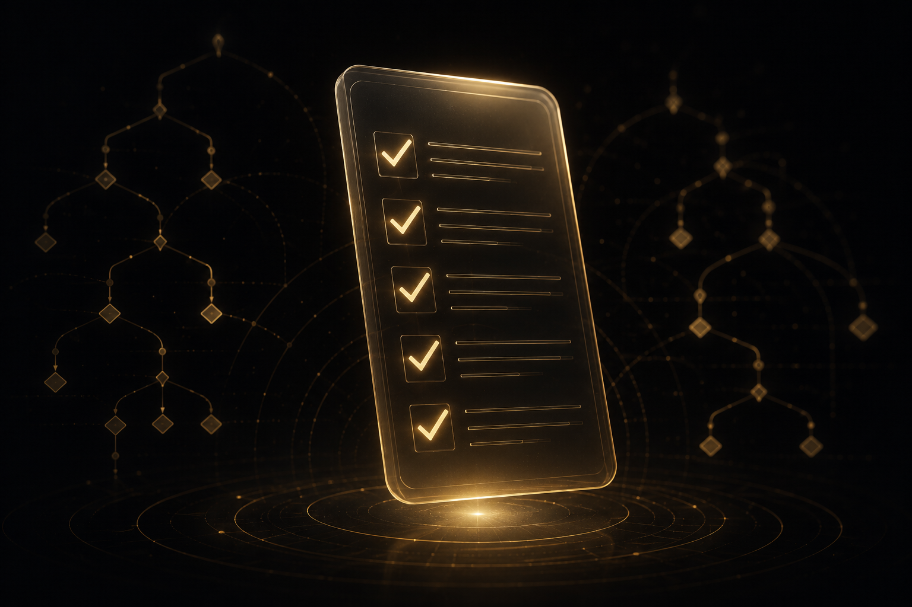
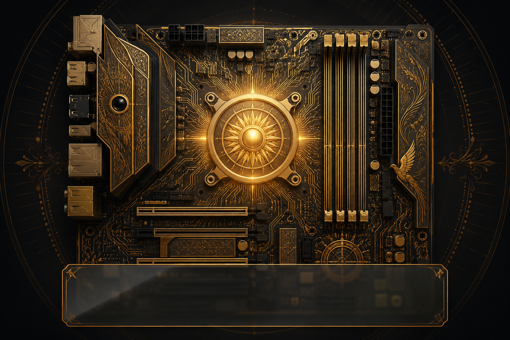
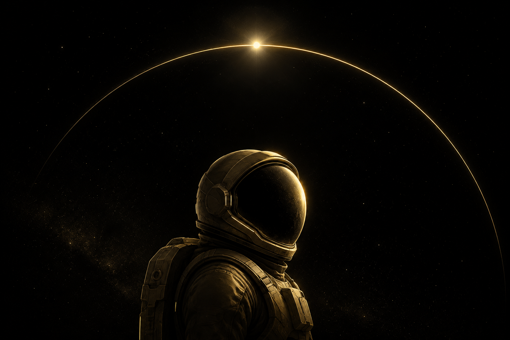
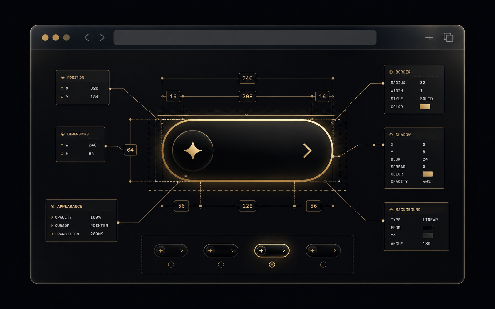

<div align="center">


# 🔥 PROMETHEUS

### Local-first, adaptive multi-model coding agent

*Bring your own models. Keep your code local.*

[]()
[]()
[]()
[]()

</div>

---

PROMETHEUS is a **local-first, adaptive multi-model coding agent**. A tool-capable
controller orchestrates optional coding, reasoning, reviewing, and vision
specialists. **Ollama is the default backend** — cloud and other
OpenAI-compatible backends are pluggable and always opt-in.

Think of it as a **local Claude Code** or **local OpenCode alternative** you
fully own. No telemetry, no quota walls, no silent cloud calls. Your code never
leaves your machine unless you explicitly send it somewhere.

## Quick install

**Linux / macOS / WSL:**
```sh
curl -fsSL https://feverdream-dev.github.io/Prometheus/install.sh | sh
```

**Windows (delegates to WSL):**
```powershell
irm https://feverdream-dev.github.io/Prometheus/install.ps1 | iex
```

> Prefer to inspect first? Download the script, read it, then run it:
> ```sh
> curl -fsSL https://feverdream-dev.github.io/Prometheus/install.sh -o install.sh
> less install.sh && sh install.sh
> ```

The installer creates an isolated, versioned venv under
`~/.local/share/prometheus/`, places `prometheus` on your PATH, and runs
`prometheus doctor`. It never touches system Python, never uses PyPI, and
never needs `sudo`.

> **Release status:** `v0.1.0` is **published**
> ([GitHub Release](https://github.com/FeverDream-dev/Prometheus/releases/tag/v0.1.0),
> published 2026-06-21). The installer automatically prefers the
> SHA-256-verified release sdist from the GitHub Release for the default path.
> The source-archive fallback (`PROMETHEUS_VERSION=main`) remains available and
> is clearly marked as unverified. Both paths are tested — see
> [`docs/INSTALLER_PROOF.md`](docs/INSTALLER_PROOF.md) for the full evidence.

## 30-second quick start

```bash
prometheus setup      # detect hardware → pick a bundle → configure Ollama
prometheus            # launch the TUI
prometheus run "Fix the failing tests" --workspace .
prometheus sessions   # list sessions + completion
```

## What makes PROMETHEUS different

| Principle | What it means |
|---|---|
| **Local-first** | Runs on your hardware. Network use is explicit and visible. No telemetry. |
| **Hardware-honest** | Detects CPU, RAM, GPU, VRAM. Recommends packages that actually fit — not aspirational ones. |
| **Evidence-driven** | A deterministic evaluator — not a model opinion — decides when a task is done. |
| **Checkpointed** | Every mutation is git-checkpointed and recoverable. Nothing is destructive by default. |
| **Permission-owned** | The deterministic engine owns permissions and tools. Models propose; the engine disposes. |

## Feature highlights

### Core agent platform

<p align="center">

</p>

- **Three-seat Arena**: Envoy (planner), Forge (coder), Argus (reviewer) with
  structured handoffs and five-block escalation
- **Three autonomy modes**: Copilot (suggestive), Pilot (balanced), Astronaut
  (autonomous within scope — destructive actions always require approval)
- **Bounded project memory**: `.prometheus/memory.md` (≤ 1024 words) + JSONL
  ledgers for tasks, decisions, evidence, and handoffs
- **Durable sessions**: SQLite store with monotonic event log, crash-recovery
  resume, git checkpoint + rollback
- **Schema-constrained tool loop**: Typed tools with risk declarations,
  permission checks, and secret redaction
- **Deterministic weighted completion**: Overrides model self-report. Cannot
  reach "complete" unless ≥ 95% of weighted acceptance criteria pass with evidence

<p align="center">

</p>

### Model management

<p align="center">

</p>

- **Seven model packages**: Spark (CPU), Ember (8 GB GPU), Forge (12 GB),
  Oracle (multimodal), Titan (24 GB), Hephaestus (coding team), VibeThinker
  (review add-on)
- **Hardware detection**: NVIDIA, AMD, Intel, Apple Silicon — recommends what
  fits, shows sizes before download
- **Consent-gated setup**: Offers to install Ollama only after explicit approval,
  discovers existing models, runs inference smoke test
- **Sequential hot-swap**: Models load one at a time unless hardware safely
  fits more; `keep_alive: 0` evicts between sessions

### Security & sandbox

<p align="center">

</p>

- **Four-tier sandbox**: `off` / `basic` / `docker` / `native`
  - `basic` hard-denies catastrophic commands (`rm -rf /`, `mkfs`, fork bombs)
  - `native` confines via bubblewrap (Linux) or sandbox-exec (macOS)
  - `docker` detected and available
- **Workspace protection**: Path-traversal and symlink-escape guards
- **Secret redaction**: 16 patterns stripped from evidence, model requests, output
- **MCP injection boundary**: MCP output treated as untrusted data, never system policy

### Astronaut Vision (CSS-snapshot inspector)

<p align="center">

</p>

```bash
prometheus vision doctor                              # Playwright availability
prometheus vision inspect http://localhost:4173 \
  --selector "button.primary" --output ./capture     # screenshot + CSS + a11y
prometheus vision compare ./capture/style.json \
  tests/fixtures/web_ui/design/button-primary.json   # matched? + WCAG contrast
prometheus astronaut tick --vision --url http://localhost:4173
```

The deterministic CSS snapshot is the **first judge**. A vision model (if
present) is a secondary reviewer that never overrides the deterministic result.
Captures 24 computed-style properties, bounding boxes, accessibility tree,
hover/focus/disabled variants, and WCAG contrast ratios.

<p align="center">

</p>

### AssetForge Lite (local image generation)

<p align="center">

</p>

```bash
prometheus assets doctor                              # rembg/diffusers/torch check
prometheus assets models                              # known models + license table
prometheus assets generate my-icon \
  --kind icon --size 512x512 --output ./assets        # manifest + README (+ image)
prometheus assets remove-bg input.png                 # rembg transparency
```

License-safe by design: every generated asset gets a manifest recording model,
license, seed, and provenance. Commercial-use policy is enforced
deterministically — Stability AI models warn, BRIA background-removal warns,
FLUX.1-schnell (Apache-2.0) passes.

### Extensibility

```bash
prometheus mcp list                                   # configured MCP servers
prometheus mcp add echo -- python -m my_mcp_server    # add a server
prometheus mcp test echo                              # init + list tools
prometheus browser test https://example.com           # Playwright evidence
prometheus bundles inspect ember-8gb-gpu               # full manifest + fit reasoning
prometheus models pull --bundle spark-cpu-8gb          # pull a package's models
```

- **MCP client**: stdio JSON-RPC (init/list/call), per-server trust scope,
  namespaced tools, output size limits with redaction
- **Playwright browser tools**: Console/network evidence collection, screenshots
  for the vision role
- **Built-in tools**: File ops (list/read/write/patch/search), process runner
  (argv array, supervised, cancellable), git (status/diff/checkpoint/rollback),
  web fetch (bounded, untrusted, citations)

### TUI slash commands

```
/help  /settings  /models  /bundles  /memory  /mcp  /tools
/sessions  /qualify  /use  /modes  /permissions  /doctor
/clear  /resume  /mode  /vision  /assets  /astronaut  /exit
```

## Model packages

<p align="center">

</p>

| Package | Hardware | Controller | ~Download | Status |
|---|---|---|---|---|
| **Spark** | CPU · 8 GB RAM | `granite4.1:3b` | ~2.1 GB | Stable |
| **Ember** | 8 GB VRAM | `qwen3.5:4b` | ~3.4 GB | Stable |
| **Forge** | 12 GB VRAM | `qwen3.5:9b` | ~8.7 GB | Stable |
| **Oracle** | 12 GB VRAM | `gemma4:12b` | ~7.6 GB | Experimental |
| **Titan** | 24 GB VRAM | `qwen3.5:27b` | ~22.3 GB | Experimental |
| **Hephaestus** | 24 GB VRAM | `qwen3.5:9b` + `devstral:24b` | ~22.7 GB | Experimental |
| **VibeThinker** | Add-on | *review only* | ~1.9 GB | Experimental |

## Architecture

<p align="center">

</p>

## Support matrix

| Platform | Status | Notes |
|---|---|---|
| Linux x86_64 | **Supported** | Verified on AMD CPU/GPU + Ollama. CI runs Ubuntu. |
| macOS (Apple Silicon + Intel) | **Supported** | CI-exercised; Metal via Ollama. |
| Windows (WSL 2) | **Supported (WSL only)** | PowerShell bootstrap installs inside WSL. |
| Windows (native) | **Not supported** | Planned. Use WSL 2 for now. |

## Privacy

- **No telemetry.** Ever. The installer and runtime never phone home.
- **Local audit logs** are user-readable and deletable.
- **Model downloads** are several GB. `setup` shows sizes *before* asking.
- **Shared Ollama models** are never removed by `prometheus uninstall`.

## For developers

```bash
git clone https://github.com/FeverDream-dev/Prometheus.git
cd Prometheus
uv venv .venv --python 3.11 && . .venv/bin/activate
uv pip install -e '.[dev,tui,browser]'
pytest -q                       # 648 passed, 8 skipped
ruff check src tests            # clean
prometheus doctor               # full hardware report
```

### Real-Ollama end-to-end (opt-in)

```bash
PROMETHEUS_E2E_OLLAMA=1 PROMETHEUS_E2E_MODEL=granite4.1:3b \
  pytest tests/test_e2e_ollama.py -q -s
```

### AssetForge image tests (opt-in)

```bash
PROMETHEUS_RUN_IMAGE_TESTS=1 pytest tests/test_assets_license_policy.py -v
```

### Project layout

```
src/prometheus_cli/     # CLI, TUI, orchestrator, providers, tools, session,
                       # hardware, onboarding, installer, sandbox, browser,
                       # MCP, splash, vision, assets, astronaut
install.sh / .ps1      # public one-line bootstraps (repo root)
website/               # GitHub Pages static install site
config/bundles/        # model bundle manifests
docs/images/           # AI-generated visual assets (FeverDream.dev style)
docs/                  # specifications, status, image prompts
tests/                 # 648 passing tests (unit + integration + e2e)
```

## Visual assets

All artwork follows the [FeverDream.dev](https://feverdream.dev) visual language:
obsidian backgrounds, gold and sandstone accents, glass-morphism panels, and
ancient-meets-technological motifs.

See [`docs/IMAGE_PROMPTS.md`](docs/IMAGE_PROMPTS.md) for the complete set of
DALL-E generation prompts used to create these visuals. Additional concept art
in [`docs/images/`](docs/images/) includes:

| Image | Usage |
|---|---|
| `hero-banner.png` | README hero, social card |
| `logo-mark.png` | Brand mark |
| `github-social.png` | GitHub repository preview |
| `doc-hero.png` | Documentation banner |
| `terminal-bg.png` | TUI preview backdrop |
| `favicon-mark.png` | Favicon source |

## Troubleshooting

| Problem | Fix |
|---|---|
| `prometheus: command not found` | `export PATH="$HOME/.local/bin:$PATH"` in `~/.bashrc` |
| Ollama not running | `ollama serve` or `brew services start ollama` |
| GPU not detected | Install NVIDIA/AMD drivers; check `prometheus doctor` |
| WSL setup | `wsl --install -d Ubuntu`, then run the Windows one-liner |
| Permission errors | The installer never needs `sudo`. If it asks, stop and inspect. |

## Product principles

1. **Local and private** by default. Internet use is explicit and visible.
2. **The deterministic engine** — never an untrusted model — owns permissions and tools.
3. **Tests and runtime evidence** determine completion, not model self-report.
4. **Every mutation** is checkpointed and recoverable.
5. **Five failures** sharing one cause trigger a different approach — not five retries.

## License

Dual license — see [`LICENSE.md`](LICENSE.md). Models retain their own upstream
licenses (Apache-2.0 for Granite, Gemma-Terms for Gemma, MIT for VibeThinker).

---

<div align="center">


**[Install](https://feverdream-dev.github.io/Prometheus/)** ·
**[GitHub](https://github.com/FeverDream-dev/Prometheus)** ·
**[Issues](https://github.com/FeverDream-dev/Prometheus/issues)** ·
**[Releases](https://github.com/FeverDream-dev/Prometheus/releases)**

Built by [FeverDream](https://feverdream.dev) — *ancient wisdom meets AI innovation*

</div>
